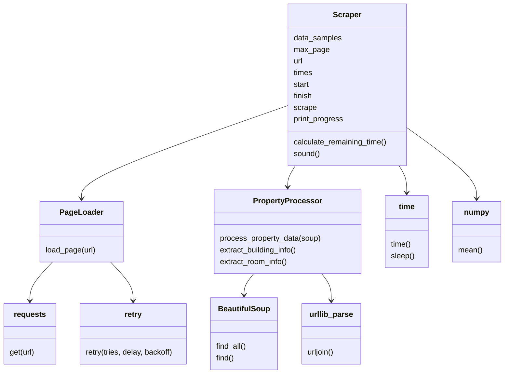

```mermaid
classDiagram
    class Scraper {
          data_samples
          max_page
          url
          times
          start
          finish
          scrape
          print_progress
          calculate_remaining_time()
          sound()
    }

    class PageLoader {
          load_page(url)
    }

    class PropertyProcessor {
          process_property_data(soup)
          extract_building_info()
          extract_room_info()
    }

    class requests {
          get(url)
    }

    class retry {
          retry(tries, delay, backoff)
    }

    class BeautifulSoup {
          find_all()
          find()
    }

    class urllib_parse {
          urljoin()
    }

    class time {
          time()
          sleep()
    }

    class numpy {
          mean()
    }

    Scraper --> PageLoader 
    Scraper --> PropertyProcessor 
    PageLoader --> requests 
    PageLoader --> retry 
    PropertyProcessor --> BeautifulSoup 
    PropertyProcessor --> urllib_parse 
    Scraper --> time 
    Scraper --> numpy 

```
