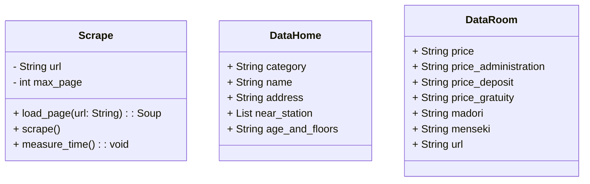

```mermaid
classDiagram
    class Scrape {
        - String url
        - int max_page
        + load_page(url: String): Soup
        + scrape()
        + measure_time(): void
    }


    class DataHome {
        + String category
        + String name
        + String address
        + List<String> near_station
        + String age_and_floors
    }

    class DataRoom {
        + String price
        + String price_administration
        + String price_deposit
        + String price_gratuity
        + String madori
        + String menseki
        + String url
    }


```
